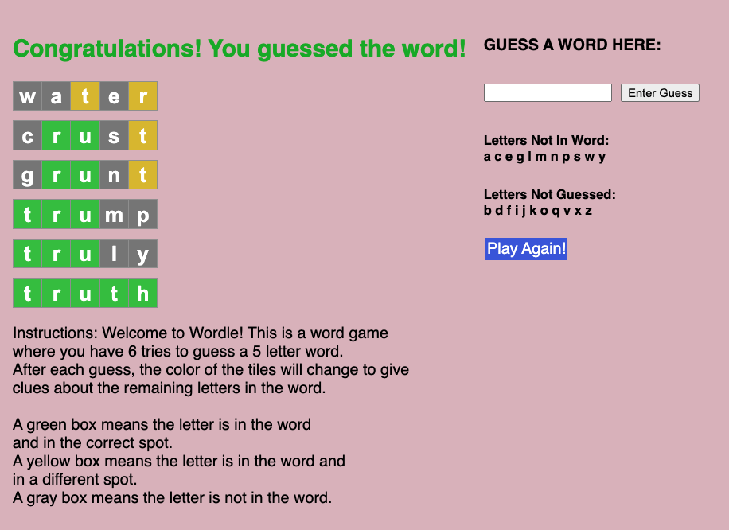

<!--
*** Thanks for checking out the Best-README-Template. If you have a suggestion
*** that would make this better, please fork the repo and create a pull request
*** or simply open an issue with the tag "enhancement".
*** Don't forget to give the project a star!
*** Thanks again! Now go create something AMAZING! :D
** TEST
-->

<!-- PROJECT SHIELDS -->
<!--
*** I'm using markdown "reference style" links for readability.
*** Reference links are enclosed in brackets [ ] instead of parentheses ( ).
*** See the bottom of this document for the declaration of the reference variables
*** for contributors-url, forks-url, etc. This is an optional, concise syntax you may use.
*** https://www.markdownguide.org/basic-syntax/#reference-style-links
-->

[![LinkedIn][linkedin-shield]][linkedin-url]

<!-- PROJECT LOGO -->
 

  

<h3 align="center">Wordle Game</h3>

  

    Wordle is a popular word game where a player has multiple guesses to guess a five letter word.
      
    Throughout the game, the player is granted hints based on their previous word guesses.
  

## Try It Out!

 Try out the game here: 
<a href = "https://morning-meadow-23275.herokuapp.com/"> <ins style="color:blue"> Go To Project</ins> </a>
 
 
 

### Built With

* [React.js](https://reactjs.org/)
* [HTML5 + CSS]

<!-- LICENSE -->
## License

Distributed under the MIT License.

<!-- CONTACT -->
## Contact

Creator - Adam Kelch (https://www.linkedin.com/in/adam-kelch/) - akelch@princeton.edu

Project Link: [https://github.com/akelch11/WordleGame](https://github.com/akelch11/WordleGame)

(<a href="#top">back to top</a>)

<!-- MARKDOWN LINKS & IMAGES -->
<!-- https://www.markdownguide.org/basic-syntax/#reference-style-links -->
[linkedin-shield]: https://img.shields.io/badge/-LinkedIn-black.svg?style=for-the-badge&logo=linkedin&colorB=555
[linkedin-url]: https://linkedin.com/in/adam-kelch
