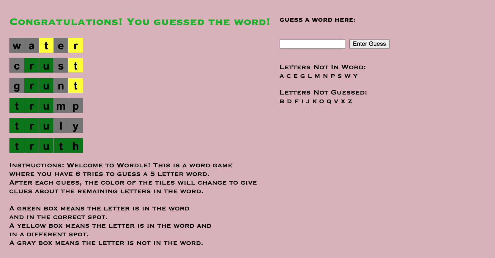

[![Contributors][contributors-shield]][contributors-url]
[![LinkedIn][linkedin-shield]][linkedin-url]

<!-- PROJECT LOGO -->
 

  

<h3 align="center">Wordle Game</h3>

  

    Wordle is a popular word game where a player has multiple guesses to guess a five letter word.
      
    Throughout the game, the player is granted hints based on their previous word guesses.
  

### Built With

* [React.js](https://reactjs.org/)
* [HTML5 + CSS]

<!-- LICENSE -->
## License

Distributed under the MIT License.

<!-- CONTACT -->
## Contact

Creator - Adam Kelch (https://www.linkedin.com/in/adam-kelch/) - akelch@princeton.edu

Project Link: [https://github.com/akelch11/WordleGame](https://github.com/akelch11/WordleGame)

(<a href="#top">back to top</a>)

<!-- MARKDOWN LINKS & IMAGES -->
<!-- https://www.markdownguide.org/basic-syntax/#reference-style-links -->
[contributors-shield]: https://img.shields.io/github/contributors/github_username/repo_name.svg?style=for-the-badge
[contributors-url]: https://github.com/github_username/repo_name/graphs/contributors
[linkedin-shield]: https://img.shields.io/badge/-LinkedIn-black.svg?style=for-the-badge&logo=linkedin&colorB=555
[linkedin-url]: https://linkedin.com/in/adam-kelch
